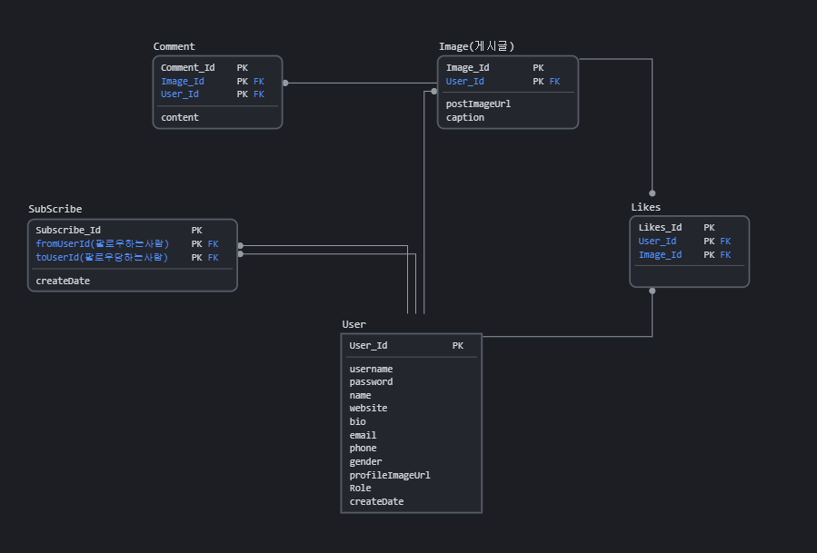

## 프로젝트 소개
- 스프링부트 인스타그램 클론코딩

## 기술 스택
   - Springboot 2.4.1
   - JPA
   - spring-security
   - spring-boot-starter-oauth2-client
   - AOP
   - lombok
   - jsp, jstl

   
## DB구조
#### ERD

## 프로젝트 명세
- [기능 명세서](https://www.notion.so/452c8c2414eb4e728c4f276fd02b075f?v=ab3467090fbf4f1ba295b68434339353)

   
## 프로젝트 화면 구상도
- 약속생성화면/메인화면

- 시간 선택 화면/약속 시간 화면

