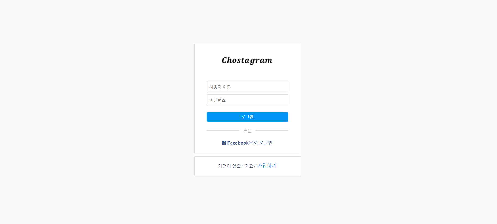
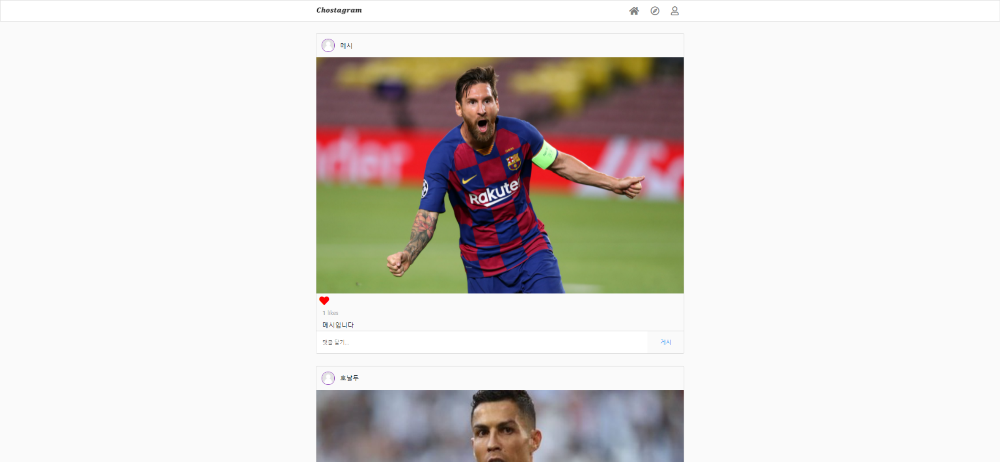
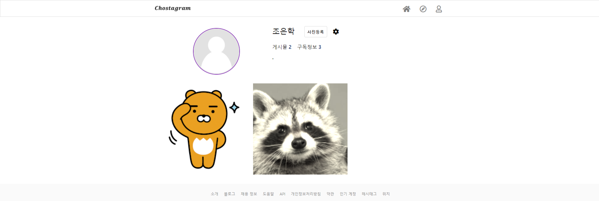

## 프로젝트 소개
- 인스타그램 클론코딩

## 기술 스택
   - Springboot 2.4.1
   - JPA
   - spring-security
   - spring-boot-starter-oauth2-client
   - AOP
   - lombok
   - jsp, jstl

   
## DB구조
#### ERD
- [ERD](https://www.erdcloud.com/d/4o95Gzequgk6HJByx)

## 기능 명세
- [기능 명세서](https://capable-fortnight-eae.notion.site/bd5fa377d3d04da094edf652ded523a3)

   
## 화면

